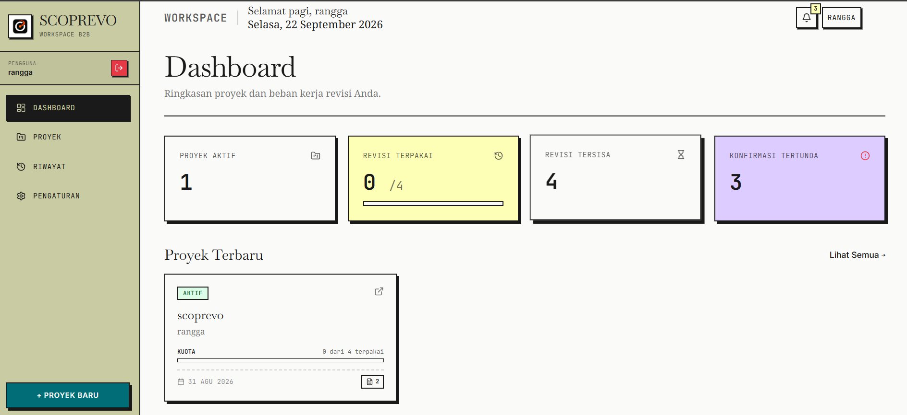
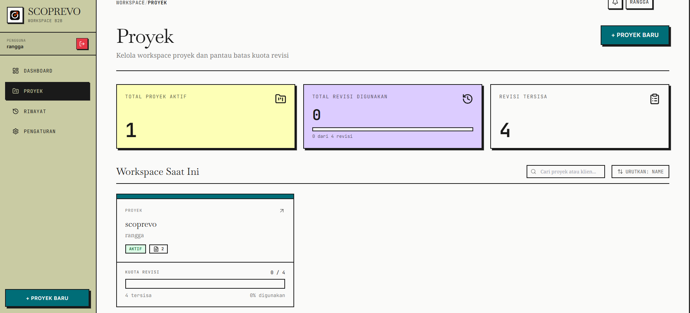
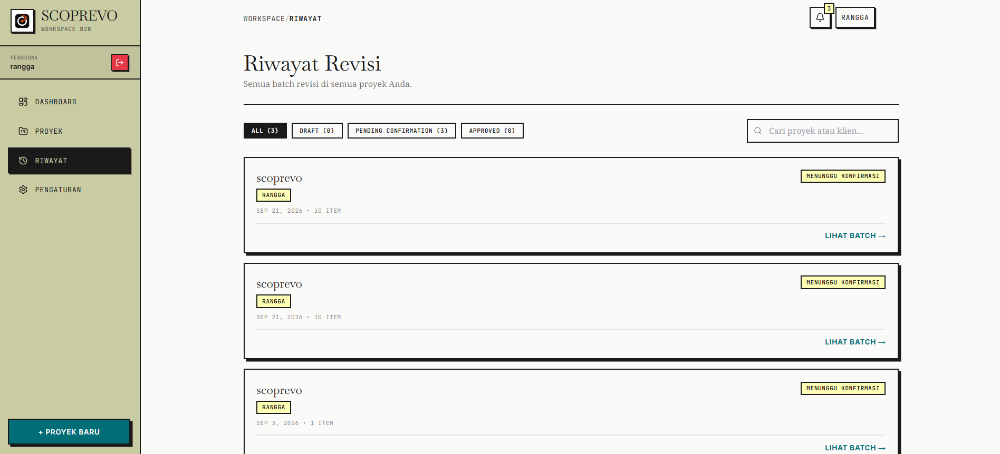
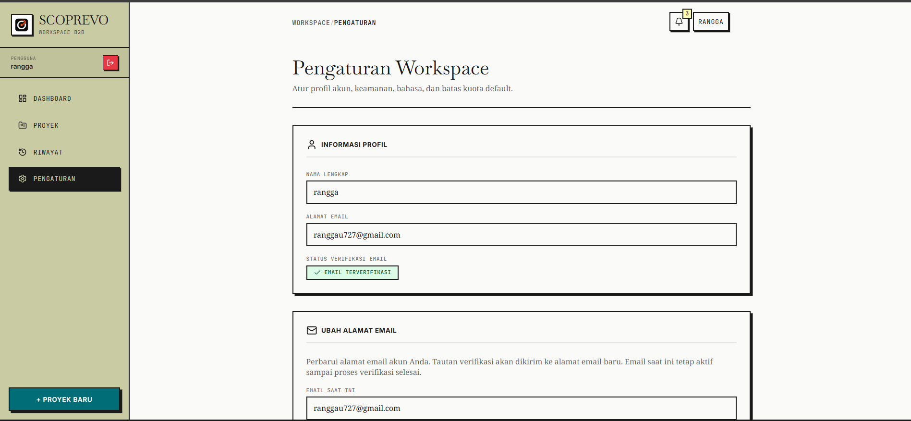

# SCOPREVO

**AI-powered Scope & Revision Intelligence.**

**🌐 Language:** [🇮🇩 Indonesia](./README.md) · **🇬🇧 English**

> Turn messy client feedback into clear revisions — and know what is inside or outside the project scope.

---

> **Note on naming/brand:** the product was previously named ScopeGuard; SCOPREVO (Scope + Revision) is the current name going forward. Visual identity (logo, color system, brand symbol) is intentionally **not locked in this document** — that ownership sits with the UI/UX Lead per the multi-AI role split (this doc, as Product/System Architect output, covers scope, data model, AI contract, and roadmap only).

SCOPREVO transforms messy client feedback (WhatsApp chats, emails) into a structured revision checklist, and automatically detects which requests fall within the project scope and which may become additional work (out of scope).

---

## 📌 Table of Contents

- [Screenshots](#-screenshots)
- [Problem](#problem)
- [Solution](#solution)
- [Why this, not a generic PM tool](#why-this-not-a-generic-pm-tool)
- [Core value in one line](#core-value-in-one-line)
- [MVP Scope (in)](#mvp-scope-in)
- [Explicitly deferred (not in MVP)](#explicitly-deferred-not-in-mvp)
- [Measuring impact (required for case study)](#measuring-impact-required-for-case-study)
- [Platform & Tech Stack](#platform--tech-stack)
- [Docs in this set](#docs-in-this-set)

---

## 📸 Screenshots

<table>
<tr>
<td width="50%">

**Dashboard**

</td>
<td width="50%">

**Projects**

</td>
</tr>
<tr>
<td width="50%">

**History**

</td>
<td width="50%">

**Settings**

</td>
</tr>
</table>

> **Note:** the Dashboard screenshot above is real. The other three slots (Projects, History, Settings) are waiting on image files — see the instructions at the end of this response for how to fill them in.

---

## 🎯 Problem

Freelancers and small agencies in Indonesia lose time and money because:

1. Client feedback is scattered and unstructured (WhatsApp, email, mixed with small talk).
2. There is no clear boundary between "agreed revisions" and "new requests that should incur additional cost" → scope creep.
3. Clients are reluctant to use heavy project management tools (Jira/Trello/Asana) that require onboarding.

## 💡 Solution

One core flow, not a Swiss-army-knife app:
Client sends messy feedback (text)
↓
AI extracts & classifies
↓
Structured revision checklist
(IN_SCOPE / OUT_OF_SCOPE / NEEDS_REVIEW)
↓
Revision quota tracked (2/3 used)
↓
Magic link sent to client
↓
Client confirms — no login needed

## 🧭 Why this, not a generic PM tool

Moxie, Plutio, and Odoo are all-in-one platforms (invoicing, CRM, scheduling, contracts, etc.). Their existence validates that freelancers need business tooling — but none of them focus deeply on one specific problem: **extracting and classifying revisions from messy feedback, then protecting project scope in real time.** SCOPREVO is intentionally narrow: one workflow, done thoroughly.

## ✨ Core value in one line

> "AI transforms unstructured client feedback into actionable revision checklists, and protects freelancers from scope creep."

## ✅ MVP Scope (in)

- Input: paste raw text (WhatsApp/email copy-paste)
- AI extraction → structured JSON (item, category, scope classification, reason)
- Revision quota tracking per project
- Magic link client portal (no login)
- Client sign-off / confirm

## 🚫 Explicitly deferred (not in MVP)

- WhatsApp Business API integration
- Voice note transcription
- OCR / PDF / DOCX / XLSX ingestion
- Payment/billing
- Team roles / RBAC
- Analytics dashboard

These are legitimate Phase 2/3 features — deferred so the MVP ships and demos cleanly.

## 📊 Measuring impact (required for case study)

Every claim must come from an actual measured run, not a marketing estimate:

| Metric | Manual | SCOPREVO |
|---|---|---|
| Time to interpret feedback | ~12–30 min | ~10–30 sec (AI) |
| Ambiguous requests caught | Often missed | Flagged as NEEDS_REVIEW |
| Out-of-scope requests caught | Often missed until too late | Flagged immediately with reason |

**Status: no real beta tester identified yet.** This is an open risk — the before/after case study needs a real feedback sample from an actual freelancer/agency contact, not a fabricated one. Do not write the case study numbers until this is resolved.

## 🛠️ Platform & Tech Stack

SCOPREVO is being built for **DevHandal 2026 Batch 2 (Codepolitan x Tencent EdgeOne)** — Misi 2 requires a technical review/tutorial based on a project actually published on EdgeOne Makers, so the app needs to be real and live on that platform (not just described).

**Locked stack:**

| Layer | Choice |
|---|---|
| Frontend | Vue 3 + Vite + TypeScript |
| Backend | Express.js + TypeScript |
| Deployment / Hosting | Tencent EdgeOne Makers |
| Serverless Runtime | EdgeOne Cloud Functions (Express mounted as a function handler) |
| Database | PostgreSQL |
| Database Provider | Supabase |
| AI | EdgeOne Models / external LLM API |
| Optional | EdgeOne KV (cache/session only, not primary storage), EdgeOne Blob, EdgeOne Observability |

**Why not KV/Blob as primary storage:** SCOPREVO's data model is inherently relational (Account → Project → RevisionBatch → RevisionItem, with foreign keys, enums, and quota calculations that depend on filtered counts). EdgeOne's native KV/Blob layer is suited to cache, session tokens, and simple config — not this shape of data. PostgreSQL via Supabase is used instead.

**Deployment structure note (unverified — confirm in EdgeOne console before building):** current best understanding is a single EdgeOne project with one root directory, where the Express backend lives inside a `cloud-functions/` folder alongside the Vue frontend source (per EdgeOne's own `express-template`), rather than two independently-rooted `apps/web` + `apps/api` folders in one project. If two fully separate deployments are wanted instead, that requires two separate EdgeOne projects pointing at two subdirectories — confirm this in the console before committing to a folder layout.

## 📚 Docs in this set

| Document | Description |
|---|---|
| 📘 [`README.md`](./README.md) | Indonesian version — project overview |
| 📘 [`README.en.md`](./README.en.md) | This file — English version |
| 🗺️ [`PHASES.md`](./PHASES.md) | Build roadmap, day by day |
| 🗄️ [`DATABASE.md`](./DATABASE.md) | Relational data model (ERD + schema) |
| 📐 [`UML.md`](./UML.md) | Use case, sequence, and state diagrams |
| 🏗️ [`APPLICATION_ARCHITECTURE.md`](./APPLICATION_ARCHITECTURE.md) | Layered architecture + API contract |
| 🎨 [`DESIGN_SYSTEM_BRUTALIST.md`](./DESIGN_SYSTEM_BRUTALIST.md) | Neo-Brutalist design system v2.1 |

---

**Built with** ❤️ **for DevHandal 2026 Batch 2**

